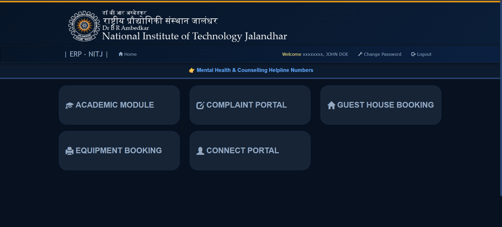
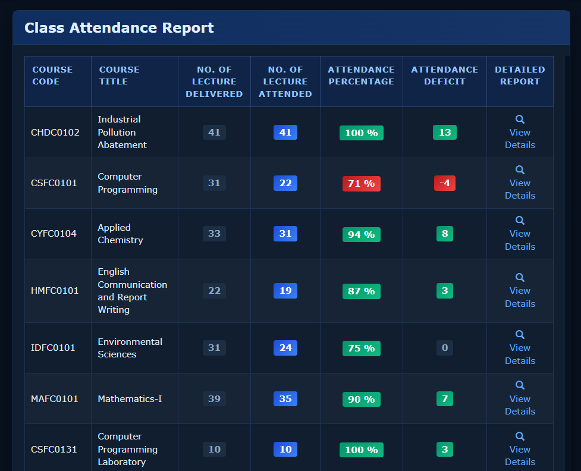

<div align="center">

<br />

```
███╗   ██╗██╗████████╗     ██╗    ███████╗██████╗ ██████╗
████╗  ██║██║╚══██╔══╝     ██║    ██╔════╝██╔══██╗██╔══██╗
██╔██╗ ██║██║   ██║        ██║    █████╗  ██████╔╝██████╔╝
██║╚██╗██║██║   ██║   ██   ██║    ██╔══╝  ██╔══██╗██╔═══╝
██║ ╚████║██║   ██║   ╚█████╔╝    ███████╗██║  ██║██║
╚═╝  ╚═══╝╚═╝   ╚═╝    ╚════╝     ╚══════╝╚═╝  ╚═╝╚═╝
```

### **ERP Utils** &nbsp;·&nbsp; Unofficial NITJ Browser Extension

[](./LICENSE)
[](https://vitejs.dev)
[](https://crxjs.dev)
[](https://developer.mozilla.org/en-US/docs/Web/JavaScript)

<br />

> _Your NITJ ERP, the way it should have been._

<br />

</div>

---

## What It Does

**NITJ ERP Utils** is a lightweight browser extension that layers useful functionality on top of the NITJ ERP: surfacing attendance deficits, polishing the interface with dark mode support, and eliminating the manual math students shouldn't have to do.

<br />

## Features

|     | Feature                           | Description                                                                |
| --- | --------------------------------- | -------------------------------------------------------------------------- |
| 🌙  | **Dark Mode**                     | System-aware dark theme for comfortable night-time browsing                |
| 📊  | **Attendance Deficit Calculator** | Instantly see how many classes you need to attend (or can skip) to hit 75% |
| ⚡  | **Lightweight & Fast**            | Zero heavy dependencies - loads in milliseconds                            |
| 🦊  | **Cross-Browser**                 | Works on Chrome, Brave, Opera, and Firefox                                 |

<br />

## Preview

> Dark mode support across the ERP interface.



> Attendance insights injected directly into the ERP report page.



<br />

---

## Installation

### Chromium-based browsers

_(Chrome, Brave, Opera, Edge)_

```bash
# 1. Clone
git clone https://github.com/Opensource-NITJ/nitj-erp-utils.git
cd nitj-erp-utils

# 2. Install dependencies
npm install

# 3. Build
npm run build
```

Then in your browser:

1. Navigate to `chrome://extensions`
2. Enable **Developer Mode** (top right toggle)
3. Click **Load unpacked**
4. Select the `dist/chromium` folder

---

### Firefox

```bash
npm run build
```

1. Open `about:debugging#/runtime/this-firefox`
2. Click **Load Temporary Add-on**
3. Select `dist/firefox/manifest.json`

<br />

---

## Development

```bash
# Start dev server with HMR
npm run dev

# Production build (outputs to dist/)
npm run build
```

<br />

---

## Tech Stack

| Layer               | Technology                       |
| ------------------- | -------------------------------- |
| Build tool          | [Vite](https://vitejs.dev)       |
| Extension framework | [CRXJS](https://crxjs.dev)       |
| Language            | JavaScript                       |
| Browser targets     | Chrome · Brave · Opera · Firefox |

<br />

---

## Disclaimer

This is an **unofficial** utility extension. It is not affiliated with, endorsed by, or connected to NIT Jalandhar in any capacity. Use at your own discretion.

<br />

---

## Contributing

Found a bug or want to add a feature? Open an issue or submit a pull request! Contributions are welcome :\)

1. Fork the repository
2. Create a feature branch: `git checkout -b feat/your-feature`
3. Commit your changes: `git commit -m 'feat: add your feature'`
4. Push and open a PR

<br />

---

## License

```
The MIT License (MIT)

Copyright © 2026 Opensource@NITJ <opensourcenitj@gmail.com>

Permission is hereby granted, free of charge, to any person obtaining a copy
of this software and associated documentation files (the "Software"), to deal
in the Software without restriction, including without limitation the rights to
use, copy, modify, merge, publish, distribute, sublicense, and/or sell copies
of the Software, and to permit persons to whom the Software is furnished to do
so, subject to the following conditions:

The above copyright notice and this permission notice shall be included in all
copies or substantial portions of the Software.

THE SOFTWARE IS PROVIDED "AS IS", WITHOUT WARRANTY OF ANY KIND, EXPRESS OR
IMPLIED, INCLUDING BUT NOT LIMITED TO THE WARRANTIES OF MERCHANTABILITY,
FITNESS FOR A PARTICULAR PURPOSE AND NONINFRINGEMENT. IN NO EVENT SHALL THE
AUTHORS OR COPYRIGHT HOLDERS BE LIABLE FOR ANY CLAIM, DAMAGES OR OTHER
LIABILITY, WHETHER IN AN ACTION OF CONTRACT, TORT OR OTHERWISE, ARISING FROM,
OUT OF OR IN CONNECTION WITH THE SOFTWARE OR THE USE OR OTHER DEALINGS IN THE
SOFTWARE.
```

<br />

<div align="center">

Made with care by [Opensource@NITJ](https://github.com/Opensource-NITJ)

</div>
